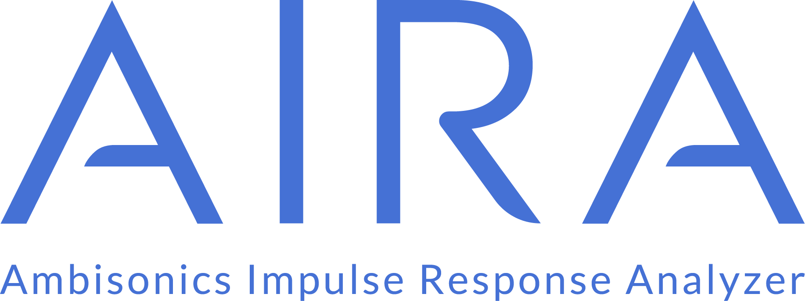
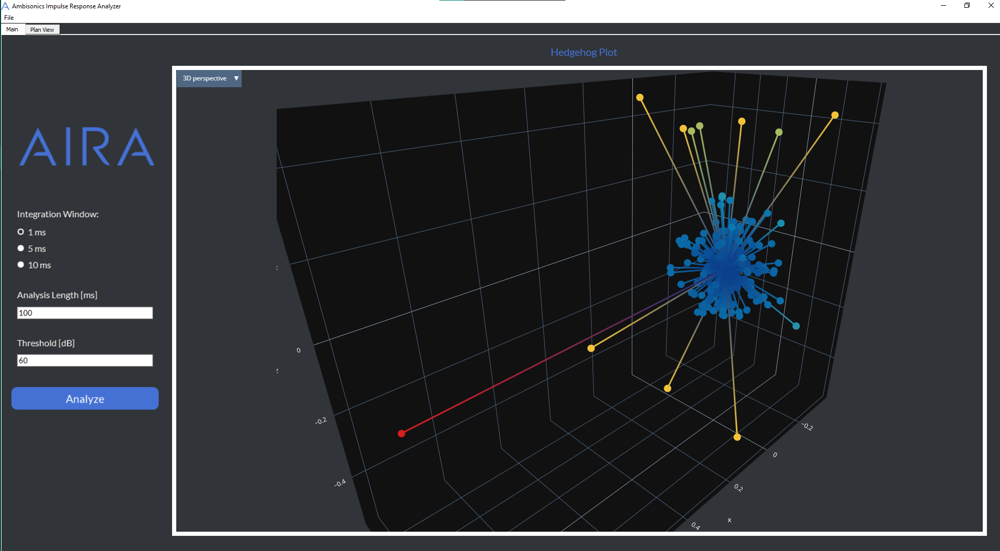

---
AIRA (Ambisonics Impulse Response Analyzer) is a novel software for visualizing impulse responses measured from Ambisonics microphones. Its innovative and interactive ui allows you to examine the reflections at a point with a hedgehog-type graph. It is also possible to export the graphs and print them on a floor plan of the analyzed room.

Here are some previews




---
## 🆕 **Demo running**
1. Download the repository
    ```bash
    git clone https://github.com/nahue-passano/AIRA.git
    cd AIRA
    ```

2. Create and initialize [poetry](https://python-poetry.org/) environment
    ```bash
    poetry install
    poetry shell
    ```

3. Run the GUI file
    ```bash
    python3 aira/gui.py
    ```

> **Usage note:** In case you do not have your own measurements, import test measurements from `test/mock_data/regio_theater`

---

## 🌱 **Getting started (develop)**

1. Download the repository
    ```bash
    git clone https://github.com/nahue-passano/AIRA.git
    cd AIRA
    ```

2. Create and initialize [poetry](https://python-poetry.org/) environment
    ```bash
    poetry install
    poetry shell
    ```

    > **Note**: If the environment already exists, run `poetry update` for possible changes in `pyproject.toml`.

3. Install the pre-commit hooks for code formating and linting with `black` and `pylint`.
    ```bash
    pre-commit install
    ```

    > **Note**: If the changes to be commited are reformated, `black` will cancel the commit. You must add again the changes with `git add` and commit again

---